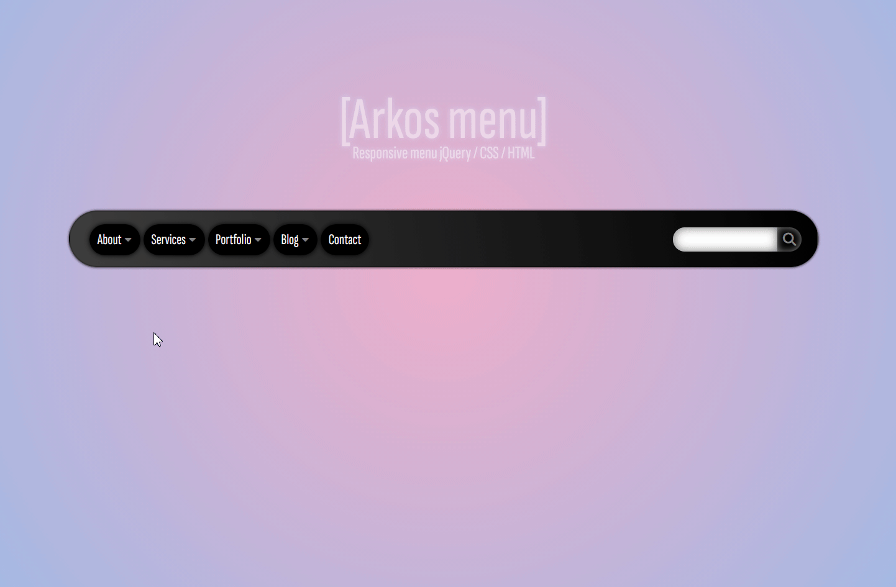

  

---

# Arkos menu - Responsive Horizontal Menu

A modern and responsive navigation menu built with **HTML, CSS, and jQuery**.

---

## 🚀 Features

* Horizontal menu (desktop)
* Mobile version with toggle button
* Smooth animations
* Simple and clean design

---

## 📦 Access to the project

The source code is not publicly available.

👉 To get the full project (ZIP file), please contact me. paralax@fluctual.fr

---

## 🛠️ Technologies

* HTML5
* CSS3
* jQuery

