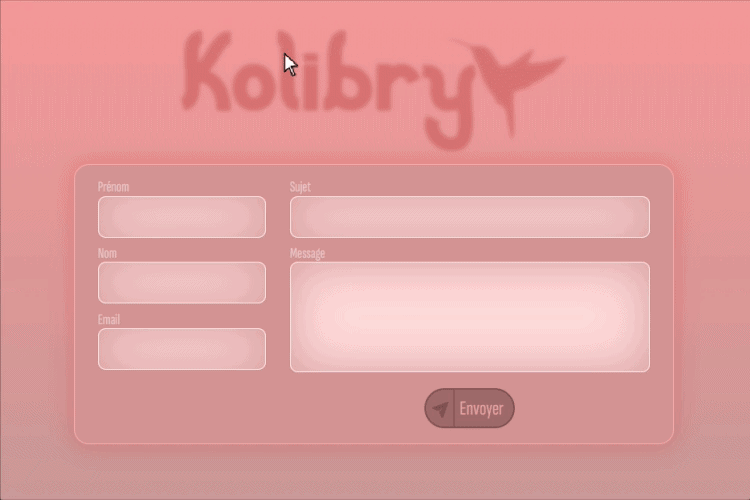

  

# Kolibry contact Form (jQuery / AJAX / PHP)

This project is a simple contact form built with **jQuery**, **AJAX**, and **PHP**.
It allows messages to be sent without page reload, with basic error handling and form validation.

---

## ⚠️ Availability

The original project is not publicly available.

If you would like to access it or learn more, please contact me directly at the following email address:

📧 [paralax@fluctual.fr](mailto:paralax@fluctual.fr)

---

## 🧩 Technologies used

* HTML / CSS
* JavaScript (jQuery)
* AJAX
* PHP

---

## 📌 Features

* Form submission without page reload
* Required fields validation
* Email format validation
* Dynamic user feedback
* Responsive form layout

---

## 📄 License

This project is not publicly distributed.

